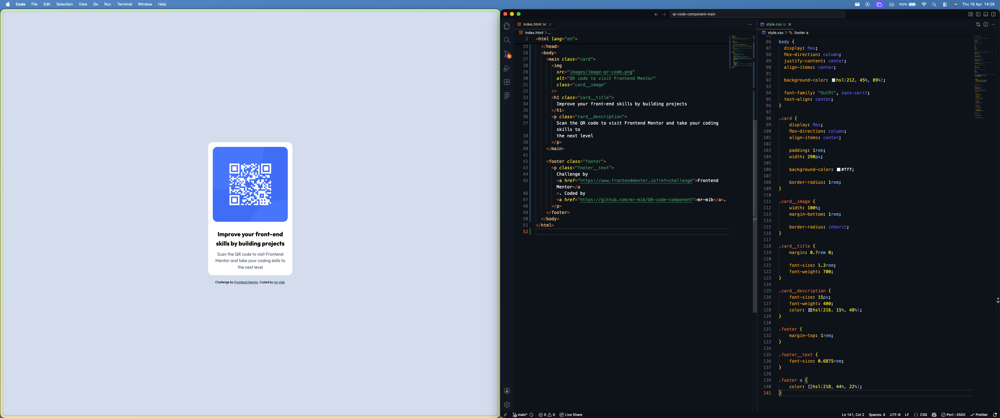

# Frontend Mentor - QR code component solution

This is a solution to the [QR code component challenge on Frontend Mentor](https://www.frontendmentor.io/challenges/qr-code-component-iux_sIO_H). Frontend Mentor challenges help you improve your coding skills by building realistic projects.

---

## Table of contents

- [Frontend Mentor - QR code component solution](#frontend-mentor---qr-code-component-solution)
  - [Table of contents](#table-of-contents)
  - [Overview](#overview)
    - [Screenshot](#screenshot)
    - [Links](#links)
  - [My process](#my-process)
    - [Built with](#built-with)
    - [What I learned](#what-i-learned)
      - [SMACSS (architecture organization)](#smacss-architecture-organization)
      - [Concentric CSS (property ordering)](#concentric-css-property-ordering)
      - [BEM (naming convention)](#bem-naming-convention)
    - [Continued development](#continued-development)
    - [Useful resources](#useful-resources)
  - [Author](#author)
  - [Acknowledgments](#acknowledgments)

---

## Overview

### Screenshot

---

### Links

- Solution URL: [https://github.com/mr-mib/QR-code-component](https://github.com/mr-mib/QR-code-component)
- Live Site URL: [https://mr-mib.github.io/QR-code-component](https://mr-mib.github.io/QR-code-component)

---

## My process

### Built with

- Semantic HTML5 markup
- CSS custom properties
- Flexbox

---

### What I learned

During this project, I focused not only on building the UI, but also on improving the way I structure and maintain my CSS code.

I discovered and started applying three key approaches:

#### SMACSS (architecture organization)

I use a clear separation of concerns to structure my CSS:

- **Base**: global styles (typography, resets)
- **Layout**: page structure (header, main, footer)
- **Components**: reusable UI blocks (cards, buttons, etc.)
- **Utilities**: small helper classes (spacing, alignment)

To help me internalize this, I use a personal mnemonic:

> **BLCU** = Base, Layout, Components, Utilities

This allows me to keep a scalable and predictable CSS architecture.

---

#### Concentric CSS (property ordering)

Inside each CSS rule, I now follow a consistent ordering strategy:

- Positioning
- Box Model
- Border
- Background
- Text
- Effects

I summarize this with:

> **PM BoBaTE** = Positioning, Model (Box Model), Border, Background, Texte, Effects

This improves readability and makes it easier to quickly locate properties within a block.

---

#### BEM (naming convention)

I also started using the BEM methodology for class naming:

- `.block`
- `.block__element`
- `.block--modifier`

This helps me write scalable and maintainable CSS, especially for reusable components.

---

Overall, these approaches helped me write CSS that is:

- more structured
- easier to debug
- easier to scale
- closer to real-world professional standards

---

### Continued development

In future projects, I want to further improve:

- my ability to structure larger CSS codebases
- consistent application of SMACSS in multi-page projects
- more advanced component-based thinking (design systems approach)
- better separation between layout and components in real projects

---

### Useful resources

- [Frontend Mentor](https://www.frontendmentor.io/) - Great platform for real-world frontend practice
- [SMACSS documentation](https://smacss.com/) - Helped me understand scalable CSS architecture
- [BEM methodology](https://getbem.com/) - Clear and practical naming convention guide

## Author

- Github - [mr-mib](https://github.com/mr-mib)
- Frontend Mentor - [@mr-mib](https://www.frontendmentor.io/profile/mr-mib)
- Twitter - [@Moustapha_I_Ba](https://x.com/Moustapha_I_Ba)

---

## Acknowledgments

This project was completed independently as part of my learning journey.

Special acknowledgment to the Frontend Mentor platform for providing structured, real-world frontend challenges.
